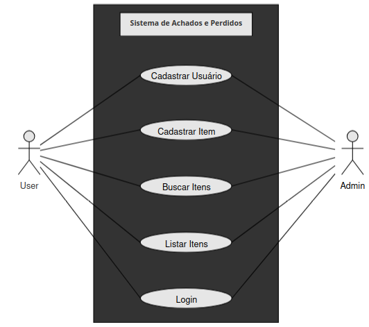

# Sistema de Achados e Perdidos

## Descrição

Este repositório contém a implementação de um sistema de achados e perdidos, permitindo o cadastro, busca e listagem de itens perdidos e encontrados.

## Diagramas UML

Foram criados diagramas UML para representar os casos de uso e fluxo de atividades do sistema:

- **Diagrama de Caso de Uso:** Representa as interações entre os usuários (User e Admin) e o sistema.
  


- **Diagrama de Atividade:** Demonstra o fluxo de operações do sistema, como cadastro e busca de itens.
  

## Funcionalidades

- Cadastro de usuários
- Login de usuários
- Cadastro de itens
- Busca de itens
- Listagem de itens cadastrados

## 👥 Equipe de Desenvolvimento

- **Aldrey Sandre** [(GitHub)](https://github.com/aldreysandre) - Modelagem de Diagramas UML; Análise do código; Revisão Final
- **Arthur Daniel** [(GitHub)](https://github.com/arthurdanielp) - Desenvolvimento e Estruturação do Código
- **Ismael Farias** [(GitHub)](https://github.com/ismlfq) - Testes de Usabilidade
- **Jean Lucas** [(GitHub)](https://github.com/jeanlucas) - Modelagem e Organização do Relatório
- **Renata Galvão** [(GitHub)](https://github.com/RehGal) - Revisão e Documentação do artigo; Plano de Apresentação
- **Wendreo Tauan** [(GitHub)](https://github.com/wendreotauan) - Desenvolvimento das Funcionalidades

## Como Usar

1. Clone este repositório:
   ```bash
   git clone https://github.com/seu-usuario/sistema-achados-perdidos.git
   ```
2. Acesse o diretório do projeto:
   ```bash
   cd sistema-achados-perdidos
   ```
3. Instale as dependências necessárias (caso existam):
   ```bash
   pip install -r requirements.txt
   ```
4. Execute a aplicação:
   ```bash
   python app.py
   ```

## Licença

Este projeto está licenciado sob a [MIT License](LICENSE).


